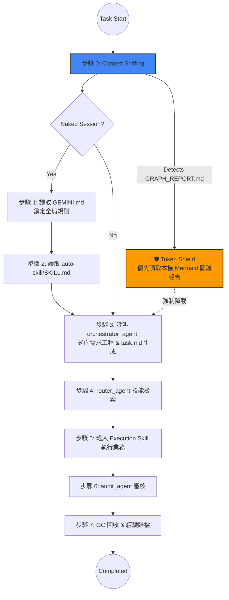

# 🪐 MOSA Framework (Markdown-Oriented Skill Architecture)

**MOSA (Markdown-Oriented Skill Architecture)** 是一個專為大語言模型 (LLM) 與 Agentic Coding Assistant 設計的解耦型、極致輕量的軟體工程工作流框架。

它的核心精神是以 **Markdown 為原生靈魂**，透過 **Pointers Only (僅存指標)** 哲學與首創的 **免 LLM 原生拓補感知 (Native Mermaid Topology)**，徹底解決 AI 助手在處理龐大庫存代碼時常遇到的「上下文漂移 (Context Drift)」與「Token 無效燃燒」痛點。

---

## ✨ 核心設計哲學

1.  **Markdown-Oriented**：所有法則、技能 (Skills)、記憶堆疊與狀態追蹤皆使用嚴格規範的 Markdown 設計。利用自然語言與標籤格式，讓 AI 原生直覺秒懂，無需昂貴的 Schema 轉換。
2.  **Pointers Only (指針隔離化)**：Agent 之間絕不傳遞全量大數據。任務參數僅使用檔案的絕對路徑 (Pointers)。這保證了短期記憶 (Short-term context) 始終聚焦於邏輯推理，而非被資料內容沖刷。
3.  **Zero-Cost Topology (零成本圖譜感知)**：利用本機目錄遍歷技術，自動生成包含 Mermaid 語法的高密度架構報告 (`GRAPH_REPORT.md`)，替代全域 Grep，達成 **71x 以上的 Token 節流**。

---

## 🏛 架構分層 (The 4 Layers of MOSA)

MOSA 透過嚴格的分層將任務意圖與具體邏輯徹底解耦：

*   **Layer A: 系統與協議 (Protocols)**  — 本體位於 `GEMINI.md`，定義所有 Agent 必須遵守的憲法、狀態傳遞守則、文件命名規範與統一啟動序列。
*   **Layer B: 記憶與認知 (Memory)**  — 使用 `00_System/prompt_stack.md` 作為長效記憶錨點；`knowledge-base/` 與 `experience/` 作為經驗資產，防止專案隨回合增加而產生的認知偏差。
*   **Layer C: 執行層 (Agents & Skills)**  — 技能定義於 `skills/` 與 `workflows/` 下。透過 `skills_registry.json` 進行元數據映射。
*   **Layer D: 工作空間沙盒 (Workspace Sandboxing)** — 嚴格限制在 `00_System` (配置)、`01_Work` (運行)、`02_Output` (交付) 三段式目錄內運作，物理級別隔離專案干擾。

---

## 🔄 核心運作邏輯 (MOSA Lifecycle)

### 統一啟動序列 (7-Step Sequence)

MOSA 保證每一次互動都能收斂回統一的起點，不論是否發生上下文記憶丟失 (Naked Session)。

---

## 🧠 技能匹配邏輯 (How It Matches)

這是 MOSA 實現「快速響應、精準調度」的核心技術：

### 1. 意圖解構 (Deconstruction)
`orchestrator_agent` 接收用戶原始需求，透過 `auto-skill` 的 Meta-Logic 將其解構為一個或多個原子關鍵詞 (Keywords)。

### 2. 路由檢索 (Routing)
`router_agent` 啟動，讀取並掃描 `~/.gemini/antigravity/skills/skills_registry.json`。

### 3. 多維度權重匹配 (Semantic Matching)
匹配機制根據以下優先順序進行過濾：
*   **ID Match**: 優先匹配與任務名稱高度重合的 `skill_id`。
*   **Tag Overlap**: 任務關鍵詞與 Skill `tags` 的重疊數量。
*   **Category Context**: 根據當前工作空間類別（如 `Design`, `Financial`, `Core`）限縮搜索範圍。
*   **Complexity Check**: 根據任務難度，選擇低複雜度 (Low) 或高精準度 (High) 的 Skill。

### 4. 指針返回 (Path Returns)
`router_agent` 不返回技能內容，僅返回 1~3 個最優解的 **SKILL.md 絕對路徑指標**。

---

## 🛠 內建核心技能 (Core Skills Matrix)

### 🛸 `mosa-graph-builder` (拓撲建置器)
*   **特點**：本機免 API 呼叫。
*   **功能**：分析目錄結構，自動識別 **God Nodes (上帝節點)**，並生成可視化 `mermaid` 關係圖。
*   **防禦**：自動部署 `AGENTS.md` 規則護盾，強制後續 Agent 進入「低算力導航模式」。

### 🛡️ `mosa-harmonizer` (大一統協調員)
*   **功能 1**：全量審計架構完整性，找出硬編碼路徑。
*   **功能 2**：比對索引與實際檔案，定位 **Orphan Nodes (孤島技能)**。
*   **功能 3**：同步修正框架中的邏輯斷點。

### 🧠 `auto-skill` (自進化中樞)
*   **功能**：處理經驗歸檔。在任務結束階段，自動將 `implementation_plan.md` 的關鍵成就轉化為新技能或加入知識庫。

---

## 📂 工作空間沙盒化規範 (Workspace Sandboxing)

| 資料夾 | 強制規範內容 | 用途 |
| :--- | :--- | :--- |
| `00_System/` | `prompt_stack.md`, `state.json` | 存儲長效記憶、任務計次與漂移閾值 (Drift Threshold)。 |
| `01_Work/` | `task.md`, `session_state.json` | 執行過程的暫存沙盒。所有寫入、分析皆在此發生。 |
| `02_Output/` | 最終交付物, `walkthrough.md`, `Archive/` | 任務結束後的沉澱。專供用戶查閱與歸檔。 |

> [!CAUTION]
> **Workspace Isolation**: Agent 被嚴格禁止跨越 Sibling 目錄讀取檔案（除非顯式授權）。所有路徑必須從當前活躍文件的 `00_System` 向上錨定 Root。

---

## 📜 審計觸發協議 (Audit Rules)

為確保在極致的 Token 節流下不犧牲程式安全性，發生以下情況時強制觸發 `audit_agent`：

1.  單次任務涉及 **≥5 個檔案** 的實體修改或寫入。
2.  任務被手動標記為 `[Critical]` 或涉及敏感數據（金融、利息、個人資料）。
3.  用戶於對話中主動要求「檢查」或「審核」。
4.  任何 Sub-Agent 連續返回二次 **[Status: Fail]**。

---

*“Simplicity is the ultimate sophistication. All roads lead to the Pointers.” — The MOSA Protocol*
